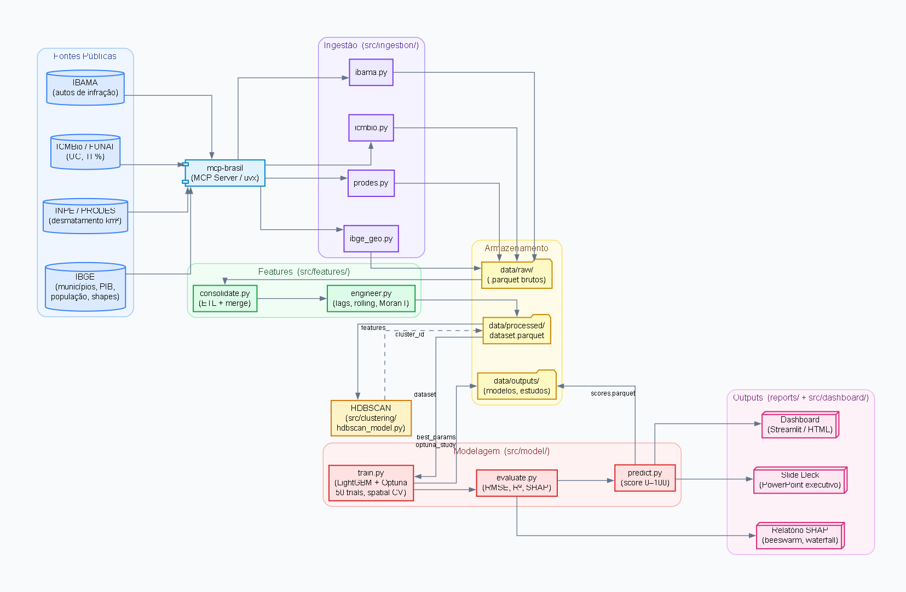

# 🌿 Preditor de Risco de Desmatamento — Amazônia Legal

Pipeline de análise de dados e machine learning para predição de risco de desmatamento em municípios da Amazônia Legal brasileira, utilizando exclusivamente dados públicos governamentais via **mcp-brasil**.

---

## Visão geral

O projeto atribui um **score de risco de desmatamento (0–100)** para cada um dos municípios da Amazônia Legal, combinando séries históricas do INPE/PRODES com dados socioeconômicos do IBGE, unidades de conservação do ICMBio e autos de infração do IBAMA. O modelo é explicável via SHAP e os resultados são apresentados em um dashboard interativo com mapa de calor por município.

```
Dados públicos (mcp-brasil)
    └── INPE/PRODES · IBGE · ICMBio · IBAMA
          ↓
    ETL + Feature Engineering
    (lag features · rolling window · Moran's I local)
          ↓
    Clusterização (HDBSCAN)
    → perfis de municípios
          ↓
    LightGBM + Optuna
    (tunagem com spatial cross-validation)
          ↓
    Score 0–100 por município
    + explicabilidade SHAP
          ↓
    Dashboard Streamlit · Relatório HTML · Slide deck
```

---

## Stack

| Camada | Tecnologias |
|---|---|
| Dados | `mcp-brasil`, `pandas`, `geopandas` |
| Análise espacial | `libpysal`, `esda`, `splot` |
| Feature engineering | `feature-engine`, `pandas` |
| Clusterização | `hdbscan`, `scikit-learn` |
| Modelagem | `lightgbm`, `optuna` |
| Validação | `spatial-kfold` |
| Explicabilidade | `shap` |
| Visualização | `streamlit`, `folium`, `plotly` |

---

## Fontes de dados

Todos os dados são obtidos via **[mcp-brasil](https://github.com/Mcp-Brasil/mcp-brasil)**, um MCP server open-source que conecta agentes de IA a APIs públicas brasileiras. Nenhum dado é coletado manualmente ou via scraping.

| Fonte | Dados utilizados |
|---|---|
| **INPE / PRODES** | Alertas históricos de desmatamento por município |
| **IBGE** | Dados socioeconômicos municipais (PIB agropecuário, população, área) |
| **ICMBio** | Unidades de conservação e terras indígenas |
| **Portal da Transparência / IBAMA** | Autos de infração ambientais por município |

---

## Estrutura do repositório

```
desmatamento-amazonia/
├── CLAUDE.md               # Instruções para o Claude Code
├── specs/
│   ├── requirements.md     # Requisitos funcionais e não funcionais
│   ├── design.md           # Arquitetura e design técnico
│   └── tasks.md            # Tarefas atômicas com dependências
├── data/
│   ├── raw/                # Dados brutos coletados via mcp-brasil
│   ├── processed/          # Dataset consolidado municipio×ano
│   └── outputs/            # Predições, estudo Optuna, métricas
├── notebooks/              # EDA e experimentos exploratórios
├── src/
│   ├── ingestion/          # Coleta de dados via mcp-brasil
│   ├── features/           # ETL, lag features, Moran's I
│   ├── clustering/         # HDBSCAN e perfis de municípios
│   ├── model/              # LightGBM, Optuna, SHAP
│   └── dashboard/          # Streamlit e outputs visuais
├── reports/                # Dashboard HTML, slide deck e diagrama de arquitetura
└── requirements.txt
```

---

## Pipeline detalhado

### 1. Ingestão
Scripts em `src/ingestion/` fazem chamadas ao mcp-brasil para coletar e persistir os dados brutos em `data/raw/` no formato `.parquet`. Inclui retry logic e cache local para evitar chamadas repetidas.

### 2. ETL e limpeza
Consolidação das quatro fontes em um único DataFrame `município × ano`, filtrado para os 9 estados da Amazônia Legal (AM, PA, MT, RO, AC, AP, RR, TO e parte do MA). Tratamento de missing values e normalização de nomes de municípios via geopandas.

### 3. Feature engineering
- **Lag features**: taxa de desmatamento no ano anterior, há 2 e há 3 anos
- **Rolling window**: média móvel e desvio padrão dos últimos 3 e 5 anos
- **Local Moran's I** (via `libpysal` + `esda`): autocorrelação espacial do desmatamento por município — captura o efeito de vizinhança
- **Features categóricas**: presença de UC, proximidade de rodovias federais, bioma dominante, cluster HDBSCAN

### 4. Clusterização (HDBSCAN)
Identificação de perfis de municípios usando features ambientais e socioeconômicas (sem lag, para não vazar informação temporal). Perfis esperados: expansão de fronteira agrícola, pressão sobre unidades de conservação, baixo risco estrutural, desmatamento residual. Validação com silhouette score.

### 5. Modelagem (LightGBM + Optuna)
Tunagem de hiperparâmetros com Optuna (50+ trials), onde a **função objetivo usa a média do RMSE nos folds de spatial cross-validation** — nunca split aleatório. O estudo Optuna é salvo em `data/outputs/optuna_study.pkl` para reproductibilidade. O modelo final é treinado com os melhores hiperparâmetros e avaliado com métricas por fold espacial (RMSE, MAE, R²).

### 6. Score e explicabilidade
O output do modelo é normalizado para a escala 0–100 por percentil. SHAP fornece importância global das features e waterfall plots para municípios individuais — incluindo breakdown por cluster.

---

## Como executar

### Pré-requisitos

- Python 3.10+
- Chave gratuita do Portal da Transparência (opcional): [api.portaldatransparencia.gov.br](https://api.portaldatransparencia.gov.br)

### Instalação

```bash
git clone https://github.com/seu-usuario/desmatamento-amazonia.git
cd desmatamento-amazonia
pip install -r requirements.txt
```

### Configuração do mcp-brasil

Crie o arquivo `.claude/mcp.json`:

```json
{
  "mcpServers": {
    "mcp-brasil": {
      "command": "uvx",
      "args": ["--from", "mcp-brasil", "python", "-m", "mcp_brasil.server"],
      "env": {
        "TRANSPARENCIA_API_KEY": "sua-chave-aqui"
      }
    }
  }
}
```

### Executando o pipeline

```bash
# Coleta de dados
python src/ingestion/inpe.py
python src/ingestion/ibge.py
python src/ingestion/icmbio.py
python src/ingestion/ibama.py

# ETL e feature engineering
python src/features/etl.py
python src/features/engineering.py

# Clusterização
python src/clustering/hdbscan_profiles.py

# Modelagem (tunagem + treino final)
python src/model/tune.py      # Optuna — pode levar alguns minutos
python src/model/train.py     # Treino final com best_params.json
python src/model/explain.py   # SHAP

# Dashboard
streamlit run src/dashboard/app.py
```

---

## Outputs e Visualizações

### Arquitetura do Pipeline



O diagrama acima mostra o fluxo completo do projeto, desde as fontes públicas até os outputs finais. Para regenerar:

```bash
python src/reports/build_arquitetura.py
```

---

### Dashboards

O projeto oferece dois dashboards complementares:

#### Dashboard HTML — `reports/dashboard.html`

Dashboard **single-file, sem dependências**, pronto para distribuição. Abre diretamente no navegador sem precisar de servidor Python.

- **Mapa coroplético** interativo (Leaflet.js) com score de risco 0–100 por município
- **Ranking** dos 20 municípios de maior risco, filtrável por ano e UF
- **Aba de Clusters** — distribuição espacial dos perfis HDBSCAN com cards descritivos
- **Série temporal** — evolução do desmatamento por estado (2008–2026)
- **SHAP** — beeswarm global, importância por cluster e waterfall dos top-5 municípios
- Suporte a **tema claro/escuro**
- Filtros por **ano** e **estado (UF)**

Para regenerar após novo ciclo de predições:

```bash
python -m src.dashboard.build_html
```

#### Dashboard Streamlit — `src/dashboard/app.py`

Dashboard **interativo com servidor**, com filtros adicionais por cluster HDBSCAN e visualizações Plotly/Folium.

```bash
streamlit run src/dashboard/app.py
```

Requer Python e dependências instaladas. Acessa automaticamente `data/outputs/predictions.parquet`.

---

### Slide Deck Executivo — `reports/slide_deck_executivo.pptx`

Apresentação PowerPoint com 10 slides widescreen (16:9) cobrindo contexto, metodologia, resultados do modelo, mapa de risco e recomendações. Gerado automaticamente a partir dos dados de predição.

Para regenerar:

```bash
python -m src.reports.build_pptx
```

---

## Metodologia: por que spatial cross-validation?

Dados geoespaciais violam a suposição de independência entre observações — municípios vizinhos têm desmatamento correlacionado. Um split aleatório tradicional colocaria municípios vizinhos simultaneamente no treino e no teste, inflando artificialmente as métricas. Este projeto usa `spatial-kfold` com UF como grupo, garantindo que cada fold de validação contenha estados geograficamente separados do conjunto de treino.

O mesmo princípio se aplica à tunagem: a **função objetivo do Optuna usa a média do RMSE nos folds espaciais**, não um split aleatório. Isso garante que os hiperparâmetros selecionados generalizam geograficamente, não apenas estatisticamente.

---

## Desenvolvimento

Este projeto foi desenvolvido com **Claude Code** seguindo o padrão **Spec Driven Development (SDD)**: especificação completa em `specs/` antes de qualquer implementação, commits atômicos por tarefa e validação de outputs a cada etapa.

---

## Licença

MIT
